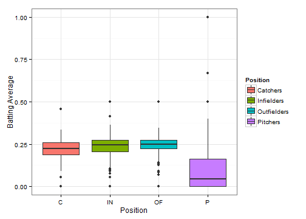
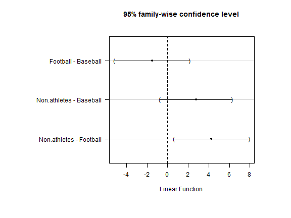

## The ACT Data

Since we didn't find evidence of a difference in the MockJury data, we won't use it here.  Instead, I'll be analyzing the ACT data.  It has one factor (Group) with three levels (Baseball, Football, Non-athletes).  Here's a summary of the data:


```r
summary(act)
```

```
     Score                Group  
 Min.   :17.00   Baseball    :8  
 1st Qu.:22.00   Football    :7  
 Median :24.00   Non.athletes:8  
 Mean   :23.87                   
 3rd Qu.:26.00                   
 Max.   :30.00                   
```

---

## Some Baseball Data

In baseball, players play different positions.  We'll break these positions down into four categories: catchers (C), infielders (IN), outfielders (OF), and pitchers (P).  There are 1021 observations in this data set (N = 1021).  We'll check to see if any of the positions have different batting averages than the others.  Here are box plots of the batting averages for the four positions:



--- &multitext

## 1. Some Information about the Baseball Data

Enter a number to answer these questions.

1. How many categorical variables are there in the baseball data?
2. How many levels are in the position variable?

*** .hint
How many categorical variables are there?  How many different categories are there in the _position_ variable?

*** .explanation
1. <span class="answer">1</span>
The only categorical variable is position.
  
2. <span class="answer">4</span>
There are four levels: catcher, infielder, outfielder, pitcher.

---

## Hypotheses for Baseball Data

We'll start by performing an F test to see if one group is different.  The hypotheses are:

$H_0: \mu_1 = \mu_2 = \mu_3 = \mu_4$

$H_A:$ at least one $\mu_j$ is different from the others.

Here is a partially filled in ANOVA table.

|           |    Df|     Sum Sq|    Mean Sq|   F value|  Pr(>F)|
|:----------|-----:|----------:|----------:|---------:|-------:|
|Position   |      |           |       1.30|          |        |
|Residuals  |      |      11.10|           |          |        |
|Total      |      |           |           |          |        |

--- &multitext

## 2. Filling in the ANOVA Table Part 1

Fill in the following.  Round all answers to 2 decimal places.

1. $df_A = $
2. $df_E = $
3. $df_{Total} = $

*** .hint
The degrees of freedom relate to the sample size and the number of groups.

*** .explanation
1. <span class="answer">3</span>
$ df_A = J-1 = 4-1$

2. <span class="answer">1017</span>
$ df_E = N-J = 1021 - 4$

3. <span class="answer">1020</span>
$ df_{Total} = df_A + df_E = N-1 = 1021-1$

--- &multitext

## 3. Filling in the ANOVA Table Part 2

Fill in the following.  Round all answers to 2 decimal places.

1. $SS_A = $
2. $SS_{Total} = $
3. $MS_E = $
4. F-statistic = 

*** .hint
Remember that $SS / df = MS$ and that the F-statistic is the ratio of the Mean Squares

*** .explanation
1. <span class="answer">3.90</span>
$SS_A = MS_A * df_A = 1.30 * 3$

2. <span class="answer">15</span>
$SS_{Total} = SS_E + SS_A$

3. <span class="answer">0.01</span>
$ MS_E = SS_E / df_E = 11.10 / 1017$

4. <span class="answer">130</span>
$ F = MS_A / MS_E = 1.30 / .01$

--- 

## Decision for ACT Data

We previously found that an  F-test for the ACT data led us to reject the null that all three groups had the same true mean ACT scores.  To write a conclusion in the context of the problem, we'd say "At the $\alpha = 0.05$ significance level, the evidence suggests that at least one scholarship group has a different true mean ACT score than the others."  Since we rejected the null, we'll use Tukey's HSD method to find out which group(s) are different from the others.  


```r
m1 <- lm(Score ~ Group, data = act)
anova(m1)
```

```
Analysis of Variance Table

Response: Score
          Df  Sum Sq Mean Sq F value  Pr(>F)
Group      2  71.002  35.501  4.5629 0.02331
Residuals 20 155.607   7.780                
```

--- &radio

## Decision for the baseball data

Our F-statistic follows an F distribution with 3 and 1017 degrees of freedom.  This yields a p-value of approximately 0.  What is our decision about the null hypothesis?  Based on this decision, is it appropriate to perform multiple comparisons?

1. Reject the null; multiple comparisons are not appropriate since we rejected the null
2. FTR; multiple comparisons are not appropriate since we failed to reject the null
3. FTR; multiple comparisons are appropriate since we failed to reject the null
4. _Reject the null; multiple comparisons are appropriate since we rejected the null_

*** .hint
Based on our decision, does it make sense to see which groups are different?

*** .explanation
Our p-value is much less than $\alpha$ so we reject the null hypothesis.  Therefore, it does make sense to check and see which groups are different so we will perform a multiple comparisons procedure.

---

## Multiple Comparisons of ACT Data

Family-wise 95% intervals are plotted below.  The only comparison for which the interval does not contain zero is the Non.athletes - Football comparison.  This suggests that the true mean ACT scores of the Non-athletes are different from the true mean ACT scores of the football players, but that the other combinations of groups are not significantly different.



---

## Confidence Intervals for Baseball Data

Family-wise 95% intervals, along with the code to make them, are plotted below.


```r
m2 <- lm(BA ~ Position, data = baseball)
require(multcomp)
mult2 <- glht(m2, linfct = mcp(Position = "Tukey"))
old.par <- par(mai=c(1.5,2,1,1))
plot(mult2)
```


--- &checkbox

## Multiple Comparisons for Baseball Data

Based on the previous plot, which groups of players are significantly different?  Check all that apply.  Make sure to hit `Show Answer` on this one (the program will not warn you if you forget a group).

1. Infielders and Catchers (IN - C)
2. Outfields and Catchers (OF - C)
3. _Pitchers and Catchers (P - C)_
4. Outfielders and Infielders (OF - IN)
5. _Pitchers and Infielders (P - IN)_
6. _Pitchers and Outfielders (P - OF)_

*** .hint
If the confidence interval comparing two groups contains zero, then we do not conclude that the groups are significantly different.

*** .explanation
All the intervals comparing pitchers to another position do not contain zero so pitchers are significantly different from each other group.  None of the other intervals contain zero so they are not significantly different.

---

## Conclusion Part 1

1) Instead of making a plot to determine which groups were different, we could have used a table like the one below:


```r
confint(mult2)
```


```
            Estimate          lwr         upr
IN - C   0.024336111 -0.008161628  0.05683385
OF - C   0.031492754 -0.003463242  0.06644875
P - C   -0.107210210 -0.140253909 -0.07416651
OF - IN  0.007156643 -0.015680002  0.02999329
P - IN  -0.131546321 -0.151332093 -0.11176055
P - OF  -0.138702964 -0.162310067 -0.11509586
```

Explain how this table could have been used to make the same comparisons.

---

## Conclusion Part 2

2) Write a concluding statement in the context of the problem for the results of the F test on the baseball data.

3) What does a family-wise 95% confidence level mean?

4) Take a look at [this comic](http://xkcd.com/882/).  Explain why it was a mistake for them to conclude that green jelly beans are related to acne.

5) Are there any changes or improvements that you would make to this activity?
